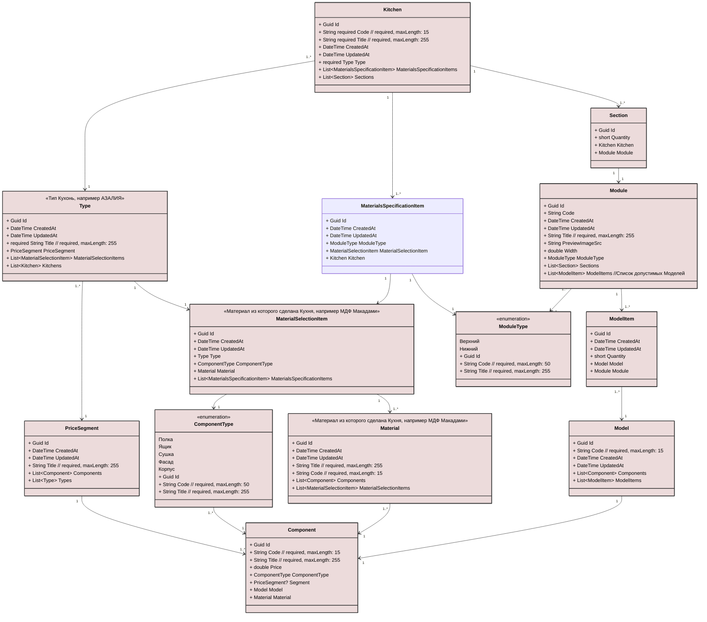

```mermaid
classDiagram

class Kitchen{
    + Guid Id
    + String required Code  // required, maxLength: 15
    + String required Title // required, maxLength: 255
    + DateTime CreatedAt
    + DateTime UpdatedAt

    + required Type Type
    + List~MaterialsSpecificationItem~ MaterialsSpecificationItems
    + List~Section~ Sections
}
class Kitchen:::someClass

class MaterialsSpecificationItem{
    + Guid Id 
    + DateTime CreatedAt
    + DateTime UpdatedAt

    + ModuleType ModuleType
    + MaterialSelectionItem MaterialSelectionItem
    + Kitchen Kitchen
}
class Type:::someClass

class Type{
    <<Тип Кухонь, например АЗАЛИЯ>>
    + Guid Id 
    + DateTime CreatedAt
    + DateTime UpdatedAt
    + required String Title // required, maxLength: 255
    
    + PriceSegment PriceSegment
    + List~MaterialSelectionItem~ MaterialSelectionItems
    + List~Kitchen~ Kitchens
}
class Type:::someClass

class MaterialSelectionItem{

    <<Материал из которого сделана Кухня, например МДФ Макадами>>
    + Guid Id 
    + DateTime CreatedAt
    + DateTime UpdatedAt
    
    + Type Type
    + ComponentType ComponentType
    + Material Material
    + List~MaterialsSpecificationItem~ MaterialsSpecificationItems
}
class MaterialSelectionItem:::someClass

class Material{

    <<Материал из которого сделана Кухня, например МДФ Макадами>>
    + Guid Id 
    + DateTime CreatedAt
    + DateTime UpdatedAt
    + String Title  // required, maxLength: 255
    + String Code  // required, maxLength: 15
    
    + List~Component~ Components
    + List~MaterialSelectionItem~ MaterialSelectionItems
}
class Material:::someClass

class PriceSegment{
    + Guid Id
    + DateTime CreatedAt
    + DateTime UpdatedAt
    + String Title // required, maxLength: 255 

    + List~Component~ Components
    + List~Type~ Types
}
class PriceSegment:::someClass

class Section{
    + Guid Id
    + short Quantity

    + Kitchen Kitchen
    + Module Module
}
class Section:::someClass

class ModuleType{
    <<enumeration>>
    Верхний
    Нижний

    + Guid Id
    + String Code  // required, maxLength: 50
    + String Title // required, maxLength: 255
}
class ModuleType:::someClass

class Module{
    + Guid Id
    + String Code
    + DateTime CreatedAt
    + DateTime UpdatedAt
    + String Title // required, maxLength: 255 
    + String PreviewImageSrc
    + double Width

    + ModuleType ModuleType
    + List~Section~ Sections
    + List~ModelItem~ ModelItems //Список допустимых Моделей
}
class Module:::someClass

class ModelItem{
    + Guid Id
    + DateTime CreatedAt
    + DateTime UpdatedAt
    + short Quantity

    + Model Model
    + Module Module
}
class ModelItem:::someClass

class ComponentType{
    <<enumeration>>
    Полка
    Ящик
    Сушка
    Фасад
    Корпус

    + Guid Id
    + String Code  // required, maxLength: 50
    + String Title // required, maxLength: 255
}
class ComponentType:::someClass

class Model{
    + Guid Id
    + String Code  // required, maxLength: 15
    + DateTime CreatedAt
    + DateTime UpdatedAt

    + List~Component~ Components
    + List~ModelItem~ ModelItems
}
class Model:::someClass

class Component{
    + Guid Id
    + String Code  // required, maxLength: 15
    + String Title // required, maxLength: 255
    + double Price

    + ComponentType ComponentType
    + PriceSegment? Segment
    + Model Model
    + Material Material
}
class Component:::someClass

Kitchen "1..*" --> "1" Type
Kitchen "1" --> "1..*" MaterialsSpecificationItem
MaterialsSpecificationItem "1" --> "1..*" MaterialSelectionItem
MaterialsSpecificationItem "1" --> "1" ModuleType
ComponentType "1..*" --> "1..*" Component
Type "1..*" --> "1" PriceSegment
Type "1" --> "1" MaterialSelectionItem
MaterialSelectionItem "1" --> "1" ComponentType
MaterialSelectionItem "1" --> "1..*" Material
Kitchen "1" --> "1..*" Section
Section "1" --> "1" Module
Module "1..*" --> "1" ModuleType
Module "1" --> "1..*" ModelItem
ModelItem "1..*" --> "1" Model
PriceSegment "1" --> "1..*" Component 
Material "1..*" --> "1" Component
Model "1" --> "1" Component 

classDef someClass fill:#ECDBDB,color:black,stroke:#333,stroke-width:2px,font-size:12pt
```
